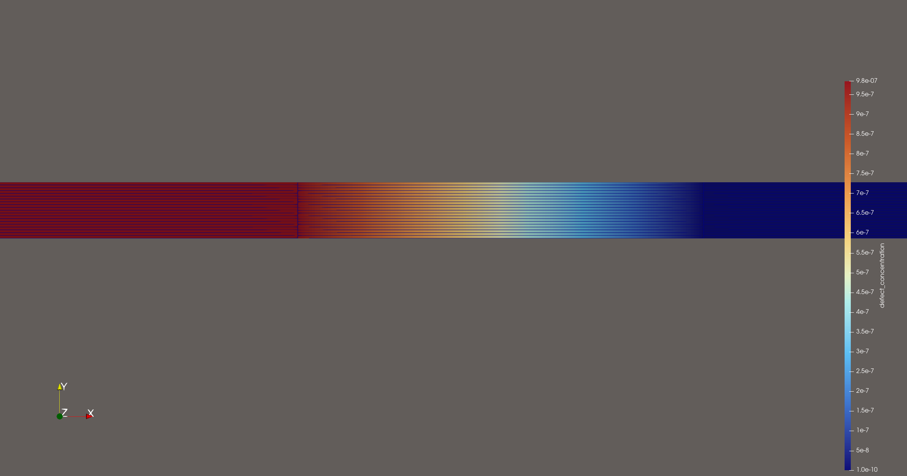

## Overview 

In this repository, the depletion and diffusion of chromium in half-inch wide disk of Ni-20Cr was modeled in MOOSE as it is irradiated by the proton beam current (2.5mm radius) and corroded by facing molten FLiNaK salt at 650°C. This is an attempt to verify the phenomena in which [Zhou et al.(2019)](https://doi.org/10.1016/j.nimb.2018.11.024) concluded proton irradiation de-accelerated corrosion of the Ni-20Cr foil in molten FLiNaK salt. 

**Features** 
- 2-D axial geometry of 30-micron Ni-20Cr foil 
- SRIM-derived displacement damage rates 
- Coupled Cr diffusion with radiative-enhanced transport 

## Geometry 
- **Disk/Foil:** Ni-20Cr disk, 12.7 mm diameter, 30 micron thick 
- **Coordinate system:** 2D cylindrical (RZ) 
- **Mesh:** 30 x 20 elements 

## Physics 
1. **Chromium diffusion:** $D = 1 \times 10^{-14}$ m2/s at 650°C 
2. **Radiation damage:** 3 MeV proton beam, 80 nA, 2.4 mm spot 
3. **Surface corrosion:** Dirichlet BC representing Cr depletion to 17%

**MOOSE Visualization of Cr Depletion**

**MOOSE Visualization of Defect Concentration** 

## SRIM/TRIM Calculation Results

### Parameters
- Ion: H (protons)
- Energy: 3 MeV
- Target: Ni-20Cr
- Density: 8.3 g/cm3
- Thickness: 30 microns 
- Ions calculated: 9999

Displacement damage calculated via SRIM-2013:

- Ion flux: $2.5465 \times 10^{13}$ ions/(m2·s)
- Displacements: 14 vacancies/ion 
- dpa rate: $1.3659 \times 10^{-10}$ dpa/s

## Summary 

**After two hours:**
- Peak defect concentration $1.3659 \times 10^{-10}$ dpa/s in irradiated region 
- Salt-facing surface depleted from 20% to 15% 
- Center Cr concentration decreased to 19.6%
- Peak radiation damage = $9.84 \times 10^{-7}$ dpa in 2.5mm diameter radius
- Damage dose consistent with SRIM-derived damage rate 
- Failed to repeat de-accelerated corrosion observed in [Zhou et al. (2019)](https://doi.org/10.1016/j.nimb.2018.11.024), as there is no discernable difference between the irradiated zone and non-irradiated zone in relation to Cr diffusion
- Further refinement is needed to model the self-healing behavior of the alloy once exposed to proton irradiation 

## References

[1] Zhou, W., Woller, K. B., Zheng, G. (Tony), Stahle, P. W., & Short, M. P. (2019). A simultaneous corrosion/irradiation facility for testing molten salt-facing materials. Nuclear Instruments & Methods in Physics Research. Section B, Beam Interactions with Materials and Atoms, 440, 54–59. https://doi.org/10.1016/j.nimb.2018.11.024

[2] Ziegler, J. F., Ziegler, M. D., & Biersack, J. P. (2010). SRIM – The stopping and range of ions in matter (2010). Nuclear Instruments & Methods in Physics Research. Section B, Beam Interactions with Materials and Atoms, 268(11), 1818–1823. https://doi.org/10.1016/j.nimb.2010.02.091
